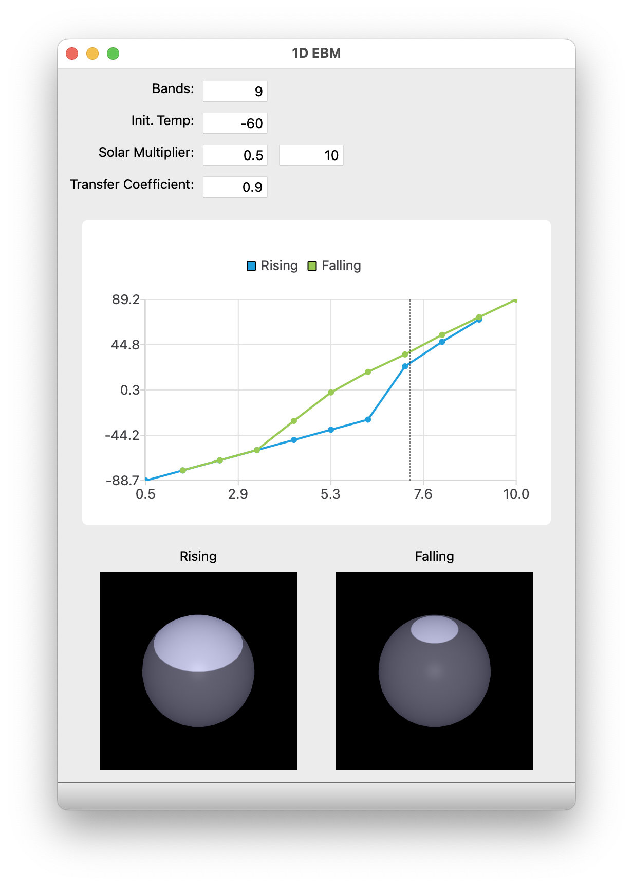

# Contents
- [Contents](#contents)
  - [Introduction](#introduction)
  - [From Matlab to Python 3](#from-matlab-to-python-3)
  - [Getting Started](#getting-started)
  - [What am I looking at?](#what-am-i-looking-at)

[](https://travis-ci.org/mchapman87501/ebm_1d)
[](https://circleci.com/gh/mchapman87501/ebm_1d)

## Introduction

I recently took an online course, ["Climate Change: The Science and Global Impact"](https://courses.edx.org/courses/course-v1:SDGAcademyX+CCSI001+3T2019/course/), by Dr. Michael Mann.  If you're looking for a gentle introduction to climate modeling and what it predicts for our planet, I highly recommend the course.

For a software developer Module 3 was especially interesting.  It offered a little math, a little geometry, and a video presentation of a one-dimensional energy balance model (1D EBM).  In the video I could see snippets of what appeared to be Matlab code.

I froze the video, jotted down a couple of function names, and started trying to learn where that code lived.

I probably could have found answers more quickly by first reviewing the module Readings.  Still, I eventually learned that several of the illustrations in the course videos, as well as the code for the 1D EBM, traced back to ["The Climate Modelling Primer", by Kendal McGuffie and Ann Henderson-Sellers](https://www.wiley.com/en-us/The+Climate+Modelling+Primer%2C+4th+Edition-p-9781119943372).

The book explained that the model had been re-implemented in many programming languages over the years.  To better understand how the model worked, I decided to translate it for myself.


## From Matlab to Python 3

This repository contains a variant of the 1D EBM written for Python 3.7.  It uses PySide2 for the GUI, together with numpy and Pillow (the latter for generating albedo texture images).

I haven't yet been able to test with Python 3.8, due to problems installing PySide2 for Python 3.8.

The code in this repository is based on the [Matlab implementation](http://nngroup.physics.sunysb.edu/~chiaki/BMCC/Mentor/Climate/NYU1DimModel/one_dim_ebm/).  I also found a JavaScript implementation, underlying [an interactive online version](http://www.climate.be/textbook/EBM.html) of the 1D EBM that's part of an online textbook:

>Goosse H., P.Y. Barriat, W. Lefebvre, M.F. Loutre and V. Zunz, (2008-2010). [Introduction to climate dynamics and climate modeling.](http://www.climate.be/textbook)

The Matlab implementation represents Earth's shape in [a curious way](docs/matlab_implementation_issues.md).  The JavaScript implementation faithfully mimics the Matlab code.

This Python translation represents earth's geometry differently.  Yet, as far as I can tell, all three models exhibit hysteresis, and all illustrate climate tipping points, in the same way.


## Getting Started

To run the main program you'll need to install the packages listed in [requirements.txt](requirements.txt).

Then

```
$ python one_dim_ebm.py
```



## What am I looking at?

My UI skills are almost as rusty as my PyQt skills.  In particular the following points may not be obvious.

The chart shows global average temperature (°C) on the y axis, and solar multiplier value on the x axis.  As explained in the edX course video, the "rising" and "falling" lines show how global average temperature varies as the solar multiplier varies, first from its minimum to its maximum, and then from maximum to minimum.  The underlying code solves for each new temperature given the current model state (temperature by latitude band) and solar multiplier.


When you click on a point in the chart, the depictions of the planetary sphere update to show the planetary albedo, for rising and falling solar multiplier "trajectories", at the selected chart point.